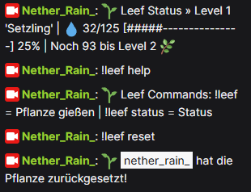
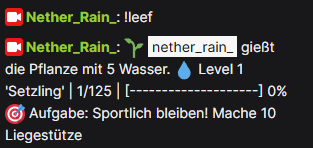
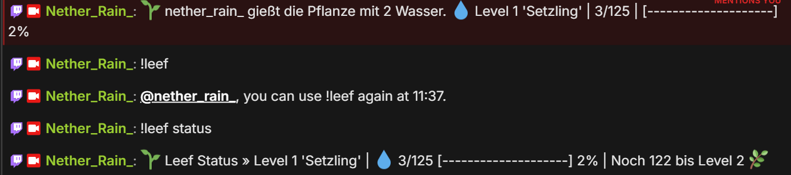

# Leef - Stream.bot Plant Game

Leef is a Twitch chat minigame for Stream.bot. Viewers water a shared plant with `!leef`, watch the plant grow through levels, and trigger a streamer task at every level-up.

Version: `1.2.1`

## Example Screenshots







---

## Features

- `!leef` waters the plant with a random amount of water (1–5)
- `!leef status` shows plant progress, current level, and next threshold
- `!leef help` shows available commands
- `!leef reset` resets the plant progress

## Requirements

- Python 3.10 or newer
- Stream.bot latest version (tested with v1.0.4)

## Files

- `leef.py` - main game logic and Stream.bot script entrypoint
- `settings.json` - gameplay settings and output controls
- `data.json` - saved plant progress

## Setup Guide

1. Download or clone the repository.
2. Keep `call_leef.py`, `leef.py`, `settings.json`, and `data.json` in the same folder.
3. Make sure Python is installed and available in your system's `PATH`.

---

## Streamer.bot Setup

### 1. Create a Command

1. Open the **Commands** tab.
2. Create a **new Command**.
3. The command name can be anything you like. In this example, it is called **Leef**.
4. Set the command trigger to:

```text
!leef
```

---

### 2. Create an Action

1. Open the **Actions** tab.
2. Create a **new Action** (left panel).
3. The action name can be anything you like. In this example, it is called **Leef**.

#### Add the following Triggers (top-right panel)

**Trigger 1**

- **Source:** Core -> Commands
- **Type:** Command Triggered
- **Command:** Leef (`!leef`)

**Trigger 2**

- **Source:** Twitch -> Chat
- **Type:** Chat Message

---

### 3. Add the C# Sub-Action

1. In the bottom-right panel, create a **new Sub-Action**.
2. Select:

- **Source:** Core -> C#
- **Action:** Execute C# Code

3. Replace the script with the following code:

```csharp
using System;
using System.Diagnostics;
using System.Text;

public class CPHInline
{
    public bool Execute()
    {
        CPH.TryGetArg("userName", out string user);
        CPH.TryGetArg("message", out string message);

        if (string.IsNullOrEmpty(user))
            user = "ChatUser";

        if (string.IsNullOrEmpty(message))
            return false;

        var psi = new ProcessStartInfo
        {
            FileName = "python",
            Arguments = $"-u \"X:\\Path\\To\\LeefCommandTTV\\call_leef.py\" \"{user}\" \"{message}\"",
            RedirectStandardOutput = true,
            RedirectStandardError = true,
            StandardOutputEncoding = Encoding.UTF8,
            StandardErrorEncoding = Encoding.UTF8,
            UseShellExecute = false,
            CreateNoWindow = true
        };

        using (var proc = Process.Start(psi))
        {
            string output = proc.StandardOutput.ReadToEnd();
            string error = proc.StandardError.ReadToEnd();

            proc.WaitForExit();

            if (!string.IsNullOrEmpty(error))
            {
                CPH.LogError(error);
                return false;
            }

            var lines = output.Split(
                new[] { '\r', '\n' },
                StringSplitOptions.RemoveEmptyEntries
            );

            foreach (var line in lines)
            {
                if (line.StartsWith("RESPONSE:"))
                {
                    string response = line.Substring("RESPONSE:".Length).Trim();
                    CPH.SendMessage(response);
                    break;
                }
            }
        }

        return true;
    }
}
```

> **Important**
>
> Replace:
>
> ```text
> X:\Path\To\LeefCommandTTV\call_leef.py
> ```
>
> with the actual path to your `call_leef.py` file.
>
> If Python is **not** available in your system `PATH`, replace:
>
> ```text
> python
> ```
>
> with the full path to your Python executable (for example: `C:\Python312\python.exe`).

---

### Optional: Per-User Cooldown

If you want `!leef` to be usable **only once per hour per user**, you can add the following code directly after:

```csharp
if (string.IsNullOrEmpty(message))
    return false;
```

This cooldown only applies to the base command:

```text
!leef
```

Subcommands such as:

```text
!leef status
!leef help
!leef reset
```

are **not** affected.

```csharp
string trimmedMessage = message.Trim();

if (trimmedMessage.Equals("!leef", StringComparison.OrdinalIgnoreCase))
{
    string cooldownKey = $"leefCooldown_{user.ToLower()}";

    DateTime? lastUse = CPH.GetGlobalVar<DateTime?>(cooldownKey, true);

    DateTime now = DateTime.Now;

    if (lastUse.HasValue)
    {
        DateTime nextUse = lastUse.Value.AddHours(1);

        if (nextUse > now)
        {
            CPH.SendMessage($"@{user}, du kannst !leef erst wieder um {nextUse:HH:mm} Uhr benutzen.");
            return false;
        }
    }

    CPH.SetGlobalVar(cooldownKey, now, true);
}
```

The cooldown is stored per user using Streamer.bot Global Variables and automatically expires after one hour.

---

## Local Test Mode

If you want to test without Stream.bot:

1. Open a terminal in the folder.
2. Run:
   ```bash
   python leef.py
   ```
3. Enter commands such as `!leef`, `!leef status`, `!leef help`, or `!leef reset`.

## Customization

Update `settings.json` to change gameplay values:

- `Command` - the chat command keyword
- `WaterMin` / `WaterMax` - random water amount range
- `WaterPerLevelBase` - base water needed for level 1
- `WaterScale` - scaling factor for higher levels
- `LevelNames` - level display names
- `TaskList` - randomized streamer tasks
- `EnableStreamMessage` - true to send chat text, false to use overlay-only mode

---

## Notes

- `overlay_state.json` is generated automatically by the script.

---

## Credits

Created by `NetherRain`.
